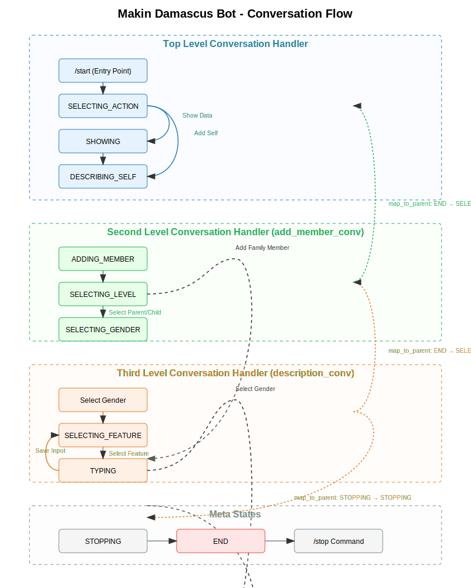

# Conversation Flow Documentation

## Overview

The Makin Damascus Bot implements a sophisticated conversation flow using nested `ConversationHandler` objects from the python-telegram-bot library. This document explains the structure and flow of conversations implemented in `main.py`.

## Conversation Structure

The bot uses a three-level nested conversation structure:

1. **Top Level** - Main menu and action selection
2. **Second Level** - Family member type selection (parents/children)
3. **Third Level** - Feature collection for the selected person

## State Definitions

The conversation states are defined as character constants:

```python
# Top level conversation states
SELECTING_ACTION, ADDING_MEMBER, ADDING_SELF, DESCRIBING_SELF = map(chr, range(4))

# Second level conversation states
SELECTING_LEVEL, SELECTING_GENDER = map(chr, range(4, 6))

# Third level conversation states
SELECTING_FEATURE, TYPING = map(chr, range(6, 8))

# Meta states
STOPPING, SHOWING = map(chr, range(8, 10))

# End state shortcut
END = ConversationHandler.END
```

## Conversation Handlers

### Third Level: Feature Collection (`description_conv`)

This handler collects specific features (name, age) for a person after gender selection.

- **Entry Points**: Triggered when a user selects gender (MALE or FEMALE)
- **States**:
  - `SELECTING_FEATURE`: User selects which feature to provide (name or age)
  - `TYPING`: User inputs the value for the selected feature
- **Fallbacks**: Options to end the current description or stop the conversation
- **Parent Mapping**: Returns to `SELECTING_LEVEL` when completed or `STOPPING` to end all conversations

### Second Level: Adding Family Members (`add_member_conv`)

This handler manages the process of adding a family member.

- **Entry Points**: Triggered when user selects "Add family member" from the main menu
- **States**:
  - `SELECTING_LEVEL`: User chooses between adding a parent or a child
  - `SELECTING_GENDER`: User selects the gender of the family member
- **Fallbacks**: Options to show collected data, return to main menu, or stop
- **Parent Mapping**: Returns to `SELECTING_ACTION` (main menu) when completed, `SHOWING` to display data, or `END` to stop

### Top Level: Main Conversation (`conv_handler`)

This is the main conversation handler that serves as the entry point for all interactions.

- **Entry Points**: Triggered by the `/start` command
- **States**:
  - `SHOWING`: Displays collected data
  - `SELECTING_ACTION`: Main menu for choosing actions
  - `SELECTING_LEVEL`: Handles family member type selection
  - `DESCRIBING_SELF`: Collects information about the user
  - `STOPPING`: Handles conversation termination
- **Fallbacks**: The `/stop` command to end the conversation

## Conversation Flow

### Starting the Conversation

The conversation begins when a user sends the `/start` command, which triggers the `start` function. This function displays the main menu with options to:

- Add a family member
- Add yourself
- Show data
- End the conversation

### Adding a Family Member

When a user selects "Add family member":

1. The top-level handler transitions to `ADDING_MEMBER` state
2. Control passes to the second-level handler (`add_member_conv`)
3. User selects parent or child (transitions to `SELECTING_LEVEL`)
4. User selects gender (transitions to `SELECTING_GENDER`)
5. Control passes to the third-level handler (`description_conv`)
6. User selects features to add (name, age) and provides values
7. When complete, control returns to the second level, then to the top level

### Adding Self Information

When a user selects "Add yourself":

1. The top-level handler transitions to `DESCRIBING_SELF` state
2. Control passes directly to the third-level handler
3. User provides their information
4. When complete, control returns to the top level

### Showing Data

When a user selects "Show data":

1. The `show_data` function is called
2. Collected data is formatted and displayed
3. User can return to the main menu

### Ending the Conversation

The conversation can end in several ways:

- User selects "Done" from the main menu
- User sends the `/stop` command
- User selects a "Back" option that maps to `END`

## State Transitions and Mapping

A key feature of this implementation is the use of `map_to_parent` in nested handlers. This allows:

1. Seamless transitions between conversation levels
2. Proper state management when returning from nested conversations
3. Ability to completely end all conversations from any level

For example, when the third-level handler completes, it can map its `END` state to the parent's `SELECTING_LEVEL` state, allowing the conversation to continue at the appropriate level.

## Error Handling

The main function includes error handling to gracefully manage:

- Keyboard interrupts (Ctrl+C)
- Unexpected exceptions

Errors are logged using the configured logger, providing visibility into any issues that occur during bot operation.

## Visual Representation

A visual representation of this conversation flow is available in the [Flow Chart Documentation](FLOW_CHART.md). The diagram illustrates the three-level nested structure, state transitions, and parent-child mappings described in this document.



## Conclusion

The nested `ConversationHandler` structure provides a flexible and powerful way to manage complex conversation flows. By organizing the conversation into logical levels and carefully mapping states between parent and child handlers, the bot can guide users through multi-step processes while maintaining context and providing a smooth user experience.
